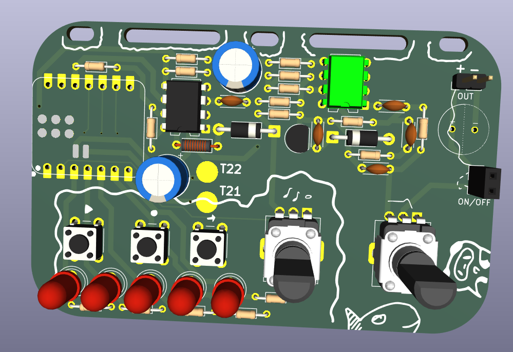

# Fallout Badge - SYNTH

Woah! A badge :O

## What is it?!

A badge with holes for mounting to a lanyard, containing within a full miniature analogue synthesizer / sequencer. 
This badge has a sawtooth vco core, with mcu controlled pitch and a manually controlled filter (modelled off of the Big Muff PI tone stage).

It also includes a small interface for playing and step recording a note sequence.

## Limitations

Due to the form factor / component limitations, this synth isn't fully featured, namely:
- It lacks a VCA (When its on it will constantly make noise)
- Untunable / no temperature compensation (Notes will be in tune with each other, but you'll only be able to tune it via software)
- Probably quite noisy and bad sounding - buzzers suck
  
## Screenshots

